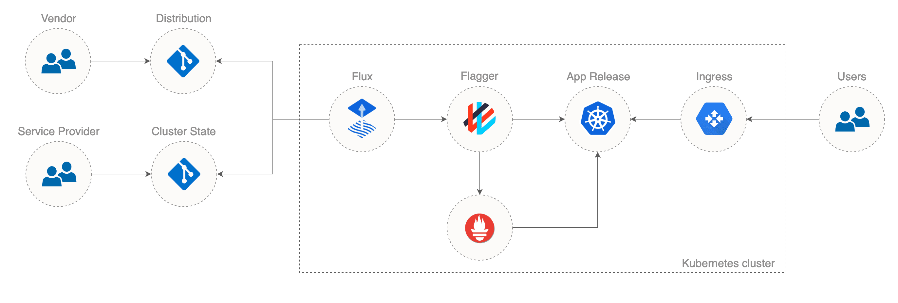

# gitops-app-distribution

As a software vendor I want to distribute my application in a reliable manner to service providers
that will host the app on their own Kubernetes clusters e.g. EKS, AKS/Linkerd, GKE/Istio.

The application is composed of several containerized micro-services: [frontend](dist/base/frontend),
[backend](dist/base/backend), [cache](dist/base/cache) and [database](dist/base/database).
Each micro-service receives periodically updates via container image releases and configuration changes.
These updates should be tested in isolation with automated e2e testing. 
Once the updates are made available to service providers, the release on production clusters
should be gated by conformance tests.

In order to ensure that the service providers SLAs are not being broken by new releases,
the release process will expose a micro-service new version to live traffic in a progressive manner,
while measuring the service level objectives (SLOs) like availability, error rate percentage and average response time.
If a drop in performance is noticed during the SLOs analysis, the release will be automatically rolled back
with minimum impact to end-users.

Service providers should have the option to customize the app to fit their SLAs e.g. set different 
resources requests and limits, tweak the auto-scaling thresholds or manual approval of canary releases.

Technical solution:
* create a repository with the manifests required to distribute the app on Kubernetes
* create a dedicated distribution for each service provider environment type
    * [Kubernetes without a service mesh](dist/app-kubernetes/README.md)
    * [Kubernetes with Istio](dist/app-istio/README.md)
    * [Kubernetes with Linkerd](dist/app-linkerd/README.md)
* use Kustomize to build each environment type (distribution) while keeping the YAML duplication at minimum
* use GitHub Actions and Kubernetes Kind to validate changes
    * [validate manifests](ci/e2e-kubeval.sh) with kubeval
    * [end-to-end testing](.github/workflows/main.yml) for Kubernetes, Istio and Linkerd distributions
* use [Flux](https://fluxcd.io) to distribute changes on the service providers clusters
    * reconcile a target cluster with an app distribution
    * monitor the base distribution and update the target cluster on spec changes
* use [Flagger](https://flagger.app) to automate the production releases on the service providers clusters
    * run conformance tests before exposing an updated micro-service to live traffic
    * run canary style deployments with progressive traffic shifting for _frontend_ and _backend_ micro-services
    * run blue/green style deployments for _cache_ and _database_ micro-services

## Distribution



A service provider will use Kustomize and FluxCD to deploy the app on production clusters.

Git repository structure:
```
app/
├── .flux.yaml
└── kustomization.yaml
```

The service provider will use one of the distributions as the kustomization base:
`dist//app-kubernetes` or `dist//app-istio` or `dist//app-linkerd`.

kustomization.yaml
```yaml
apiVersion: kustomize.config.k8s.io/v1beta1
kind: Kustomization
namespace: app
bases:
  - github.com/stefanprodan/gitops-app-distribution/dist//app-istio?ref=1.0.0
```

The service provider can further customize the application installation, for example on an Istio cluster, the ingress 
could be replaced with Istio Gateway and on a Linkerd cluster the ingress could be replaced with Gloo.

.flux.yaml
```yaml
version: 1
commandUpdated:
  generators:
    - command: kustomize build .
```

## Change management

Let's assume the vendor wants to release a new frontend version that requires 
configuration changes as well as a container image update.

Vendor workflow:
* the frontend team releases a new container image tagged `frontend:v2.0.0`
* the frontend teams creates a PR with the frontend image tag and configuration file changes
* the PR is being validated in CI with e2e tests for all distributions (Kubernetes, Istio, Linkerd)
* the PR is merged into master followed by a GitHub release e.g. `1.1.0`

Service provider workflow:
* the provider is notified about the update
* the provider create a PR on one of the production cluster git repos and changes the base to `dist//app-istio?ref=1.1.0`
* the PR is being validated in CI with e2e tests for the Istio distribution
* the PR is merged into master
* Flux detects the changes in git and fetches the upstream manifests
* Flux applies the kustomization on the cluster
* Flagger detects that the frontend image and configuration file has changed
* Flagger runs the conformance tests for the frontend micro-service
* Flagger starts to gradually shift traffic towards the new frontend version
* Flagger runs the canary analysis and validates the service level objectives (SLOs)
* Flagger promotes the new frontend version by upgrading the config and rolling the v2 image in production
* Flagger notifies the service provider on Slack or MS Teams that frontend was updated

